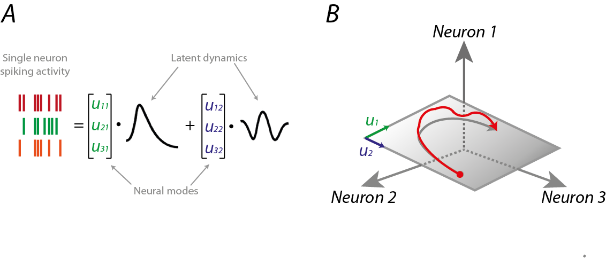

https://content.neuralink.com/compression-challenge/README.html

# the tl;dr requirements:

- 200+ lossless compression ratio
- <1ms latency --> need to implement natively in C
- <10mW (including radio overhead)
- each file provided in monochannel (flattened 1024 electrodes?), 5 seconds of data at 20kHz, 10b resolution -> is this int or fp?

# why manifolds?

# some ideas

- geodesic scaling -> nearest neighbors based methods for manifold approximation
  - in general, look into manifold learning techniques
- time series compression techniques -> difference method (delta-encoding)
  - try zipping after difference method
- dimensionality reduction over time -> TimeCluster
- FFT/DCT -> bz2 (bz2 best performing according to mikael)
